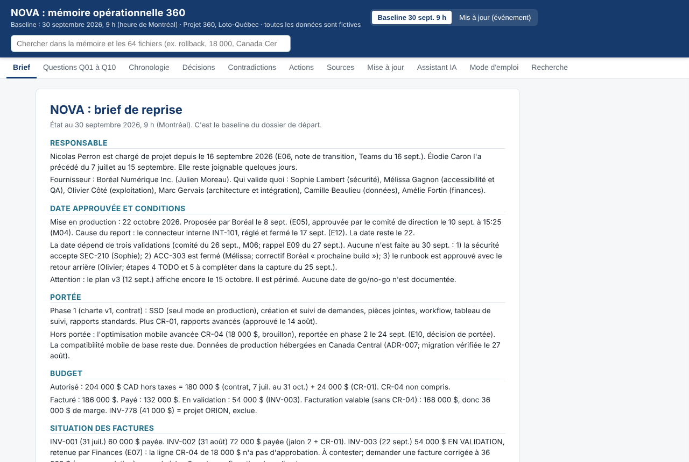
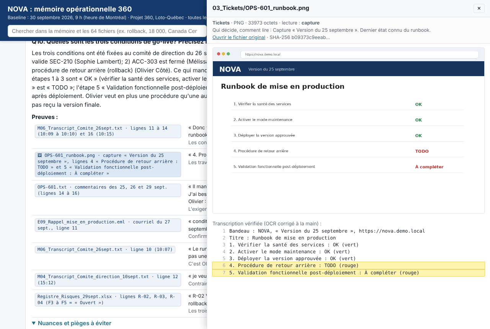
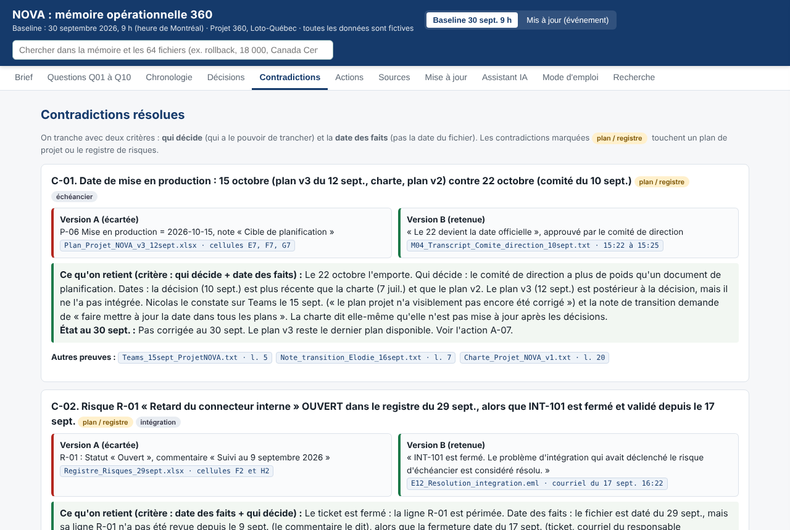
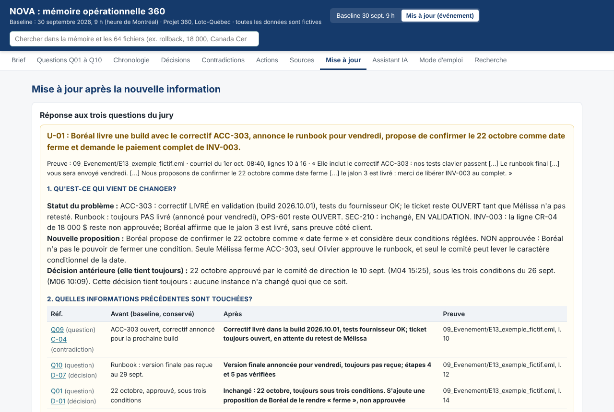

# NOVA Mémoire 360

**Équipe Side Quest. Défi 24 h « Projet 360 », Loto-Québec (défi 2 : reprendre le projet NOVA).**

Un projet, 64 fichiers éparpillés (courriels, transcriptions de réunions, tickets, plans, contrats, captures d'écran), et une question simple : si je reprends NOVA lundi matin, qu'est-ce que je dois savoir, et où est la preuve?

NOVA Mémoire 360 répond à ça. C'est une page web qui s'ouvre d'un double-clic, sans compte ni installation, et dans laquelle chaque phrase renvoie au fichier et à la ligne qui la prouvent.



## Vidéo de démonstration

**[Regarder la vidéo (5 minutes, Google Drive)](https://drive.google.com/file/d/1PWZ1nLhBADurAP89fAidhgZhLM_4xHvf/view?usp=sharing)**

Elle montre le brief, les preuves cliquables, une contradiction tranchée, et l'ajout d'une nouvelle information sans perdre l'historique. Le fichier `NOVA360.mp4` fait 100 Mo, un peu trop pour GitHub, d'où le lien.

## Ouvrir le rendu en 10 secondes

1. Téléchargez ce dépôt (bouton vert « Code », puis « Download ZIP ») ou clonez-le.
2. Ouvrez `NOVA_Memoire_360/index.html` dans un navigateur (Chrome, Edge, Firefox ou Safari).
3. C'est tout. Tout est dans le fichier : le texte des 64 documents, les captures, la mémoire. Ça marche hors ligne.

Pour l'assistant local (optionnel), ouvrez plutôt la page avec `NOVA_Memoire_360/Ouvrir_avec_serveur_local.command` (voir plus bas).

## Ce que le jury trouve, et où

| Demandé par le défi | Où le trouver |
|---|---|
| Brief de reprise d'une page : responsable, date approuvée et conditions, portée, budget, factures, priorités | Onglet **Brief**. Aussi `NOVA_Memoire_360/Brief_reprise_NOVA.pdf` |
| Mémoire consultable : chronologie, décisions, contradictions, sources, actions | Onglets **Chronologie**, **Décisions**, **Contradictions**, **Actions**, **Sources**. Aussi `Memoire_NOVA.md` et `nova_memory.json` |
| Les dix réponses avec un fichier et un repère précis pour chacune | Onglet **Questions Q01 à Q10**. Aussi `Reponses_Q01-Q10.md` |
| Mise à jour après la nouvelle information, en gardant le baseline | Onglet **Mise à jour**, puis le bouton **Mis à jour (événement)** en haut de page |
| Mode d'emploi : ouverture, navigation, outils, travail manuel, limites, incertitudes | Onglet **Mode d'emploi**. Aussi `Mode_emploi.md` |

Chaque puce de preuve `[fichier · repère]` est cliquable : le fichier s'ouvre à côté, avec les lignes citées surlignées. Pour une capture d'écran, l'image s'affiche avec sa transcription.



## L'état du projet NOVA, en six lignes

Ce que dit le dossier au 30 septembre 2026, 9 h :

- **Responsable** : Nicolas Perron, chargé de projet depuis le 16 septembre (avant lui, Élodie Caron).
- **Date** : 22 octobre 2026. Proposée par le fournisseur Boréal le 8 septembre, approuvée par le comité de direction le 10 septembre. Le plan v3 du 12 septembre dit encore 15 octobre : il est périmé.
- **Conditions** : la date dépend de trois validations fixées le 26 septembre, et aucune n'est faite. 1) La sécurité accepte SEC-210 (Sophie Lambert). 2) Le ticket ACC-303 est fermé (Mélissa Gagnon). 3) Le runbook est approuvé avec la procédure de retour arrière (Olivier Côté).
- **Budget** : autorisé 204 000 $ (180 000 $ au contrat + 24 000 $ pour le changement CR-01 approuvé). Facturé 186 000 $, payé 132 000 $.
- **Facture à régler** : INV-003 (54 000 $) contient 18 000 $ pour le changement CR-04, qui n'a jamais été approuvé. À contester.
- **Pièges du dossier** : le registre de risques du 29 septembre garde ouvert un risque réglé depuis le 17; le rapport de statut du 21 septembre met la sécurité et l'accessibilité au vert alors que rien n'est validé; une facture d'un autre projet (ORION) traîne dans les archives.

## Comment on tranche quand les sources se contredisent

Deux critères, toujours les mêmes : **qui a le pouvoir de décider** et **la date des faits** (pas la date du fichier). Une proposition n'est pas une décision. Une correction livrée par le fournisseur n'est pas validée tant que la bonne personne n'a pas retesté. Une capture ancienne ne prouve pas qu'un défaut est encore là. Dix contradictions sont tranchées comme ça dans l'onglet Contradictions, avec les deux versions côte à côte et la preuve de chaque côté.



## La nouvelle information pendant la présentation

Le baseline du 30 septembre n'est jamais modifié. Chaque nouvelle information devient une couche datée qui dit : le statut réel du problème, la décision antérieure qui tient toujours, la nouvelle proposition (et le fait qu'elle n'est pas approuvée), les faits et actions touchés avec leurs preuves, et ce qui ne change pas. Un bouton en haut de page permet de passer de la vue Baseline à la vue Mis à jour.

Pour aller vite en direct, l'onglet Mise à jour a une **aide par règles** : on colle le texte reçu, l'outil reconnaît qui parle, la nature du document et les sujets touchés, puis il remplit la fiche avec la bonne règle pour chaque sujet (qui peut valider, ce qui reste ouvert, identifiants touchés). Il ne reste qu'à écrire ce que dit le document. Pas de modèle d'IA là-dedans : des règles tirées du dossier, instantanées et vérifiables.



Le dossier `repetition/` contient notre kit d'entraînement : un guide, un faux courriel de Boréal qui cumule les pièges, et le traitement attendu.

## Comment on l'a construit

1. **Extraction automatique** des 64 fichiers avec Python : `email` pour les courriels, `openpyxl` pour les tableurs, `pdftotext` pour les PDF, Tesseract pour lire les captures. Chaque fichier reçoit une empreinte SHA-256, ce qui a permis de repérer les pièces jointes identiques à un fichier du dossier (elles ne comptent pas deux fois).
2. **Lecture croisée** de tout le dossier, puis rédaction des réponses, de la chronologie, des décisions, des contradictions et des actions. On s'est aidés d'un assistant de lecture pour aller vite, et on a vérifié à la main chaque citation dans le fichier source.
3. **Génération** d'une page web autonome (HTML, CSS, JavaScript, zéro dépendance) qui embarque le texte des sources et les captures, plus un fichier `nova_memory.json` réutilisable et des exports Markdown et PDF.
4. **Contrôle automatique** : un script vérifie que chaque citation pointe vers un fichier qui existe et vers des lignes valides.

Ce qui a été fait à la main : la lecture des captures (l'OCR a été corrigé), le choix de qui décide quoi, la résolution des contradictions, la séparation entre engagement documenté et recommandation de l'équipe, et les mentions « à confirmer » partout où le dossier ne donne pas de date.

## L'assistant local, et ce qu'on a appris en le testant

L'onglet **Assistant IA** permet de poser une question en langage naturel à un modèle qui tourne sur l'ordinateur (Ollama, aucune donnée ne sort). Il cherche d'abord les passages pertinents, puis rédige une réponse en citant fichier et ligne. Ses réponses sont marquées « brouillon, à vérifier » et ses citations sont cliquables.

On l'a testé sur un MacBook Pro sans GPU avec qwen2.5:7b. Résultat : environ 2 à 3 minutes par réponse, 7 minutes pour une fiche d'événement, et des erreurs sur la chose la plus importante du défi, qui a le pouvoir de décider (il a « fermé » un ticket que personne n'avait validé). Les traces sont dans `repetition/resultats_test_modele_local/`. C'est pour ça que la fiche d'événement passe par des règles et pas par le modèle, et que les dix réponses du baseline ont été vérifiées à la main.

Pour l'essayer : installer Ollama, `ollama pull qwen2.5:7b`, puis ouvrir la page avec `NOVA_Memoire_360/Ouvrir_avec_serveur_local.command`. Sans Ollama, tout le reste fonctionne.

## Limites, dites simplement

- La recherche est par mots-clés, pas par sens. Les mots du projet (SEC-210, runbook, CR-04) marchent mieux que des reformulations.
- Les PDF sont affichés en texte extrait, avec une mise en page approximative. L'original reste accessible par lien.
- Les montants sont en dollars canadiens hors taxes, tels qu'écrits dans le dossier.
- Les dates inconnues restent inconnues : re-test de SEC-210, prochaine build pour ACC-303, livraison du runbook, réunion de go/no-go. On ne les a pas inventées.

## Contenu du dépôt

```
NOVA_Memoire_360/          le rendu complet, à ouvrir avec index.html
  index.html               la mémoire interactive (un seul fichier)
  updates.js               les couches de mise à jour (vide au départ)
  nova_memory.json         la mémoire structurée, réutilisable
  Brief_reprise_NOVA.pdf   le brief d'une page
  Reponses_Q01-Q10.md      les dix réponses avec preuves
  Memoire_NOVA.md          chronologie, décisions, contradictions, actions, sources
  Mode_emploi.md           le mode d'emploi
  corpus/                  la copie du dossier reçu, et le dossier 09_Evenement/ pour la nouvelle information
  outils/                  les scripts pour refaire la mémoire (voir outils/README.txt)
repetition/                kit d'entraînement pour l'événement, et traces du test du modèle local
docs/                      les consignes du défi et les captures d'écran de ce README
```

Pour refaire la mémoire à partir du dossier : copiez les scripts de `NOVA_Memoire_360/outils/` dans un dossier qui contient `Projet360_NOVA_ETUDIANTS/` (il est dans `NOVA_Memoire_360/corpus/`), puis lancez `python3 extract_sources.py && python3 build.py && python3 export_docs.py`. Il faut poppler, Tesseract avec la langue française, et openpyxl.

## Équipe

Side Quest. Uriel Nguefack Yefou et l'équipe. Toutes les personnes, entreprises et données du projet NOVA sont fictives et fournies par le défi.

Licence MIT.
